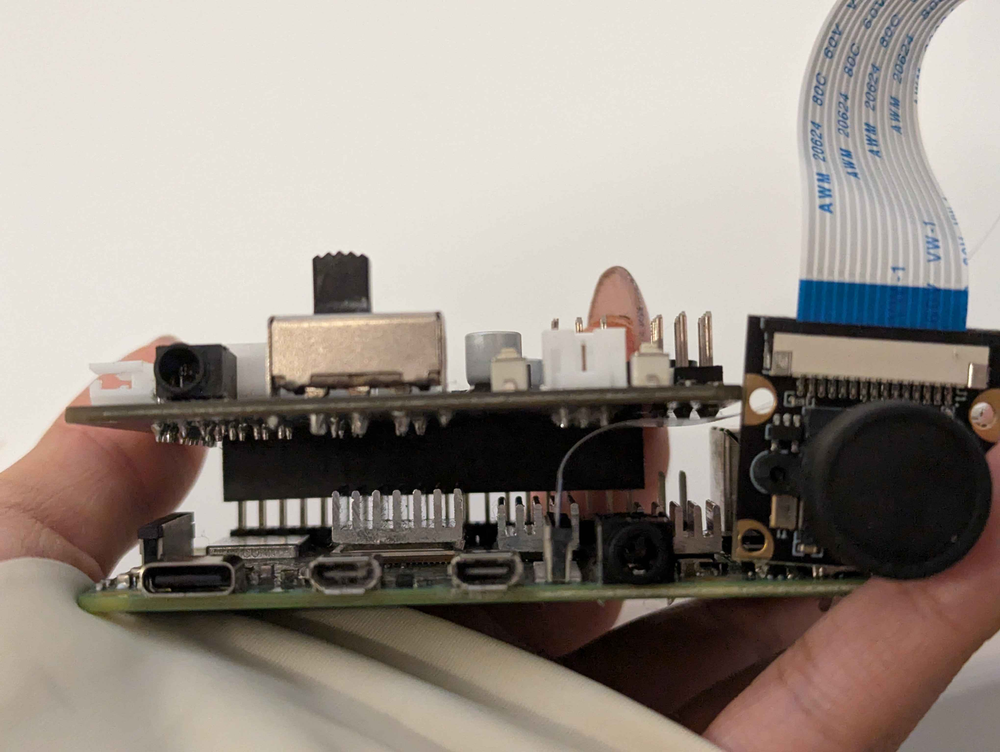
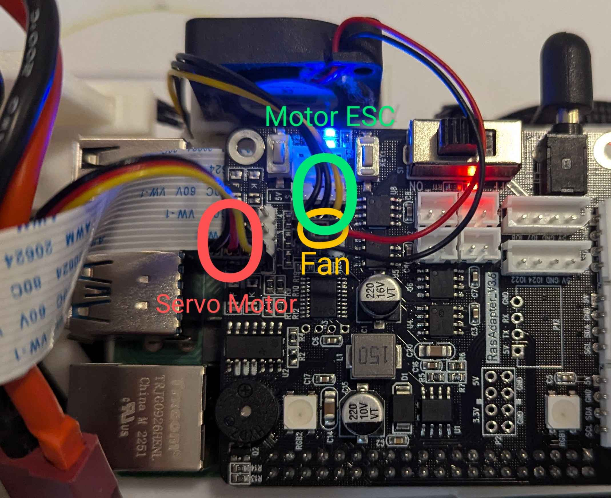

# Electromechanical diagrams

Our vehicle's schematic can be separated into 3 main areas: the power area, [the Raspberry Pi] area(#engineering-materials), and the [Pi expansion board] area(#engineering-materials).  
****As the Raspberry Pi and expansion board are not of our design, you can find their documentation on their respective sites**
  

## The Power Area
The power area contains the [main switch](#engineering-materials), [motor](#engineering-materials) and [motor ESC](#engineering-materials), and [battery](#engineering-materials).  Mandated by the rules, the main switch controls all power flowing through the vehicle. The switch is in series with the battery, which is connected to the Pi expansion board and motor ESC in parallel. Here is what the wiring would look like: 

## The Raspberry Pi Area
The Raspberry Pi Area contains the [camera](#engineering-materials) and [Raspberry Pi](#engineering-materials). The [Raspberry Pi](#engineering-materials) takes in the data from the [camera](#engineering-materials), calculates the outputs, and then sends the outputs to the correct movement instructions to the [expansion board](#engineering-materials) through the 24 connected pins.

## The Expansion Board Area
The expansion board area receives and distributes power, and controls the movement of parts. It is connected to the switch + battery, the Raspberry Pi, the motor ESC, the servo motor, and the fan. It receives instructions through the 24 pin holes connected to the Raspberry Pi and sends them to the motors.
