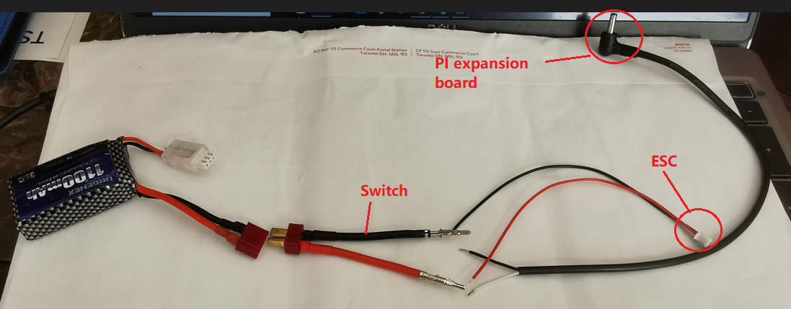

# Electromechanical diagrams
====

Our vehicle's schematic can be separated into 3 main areas: the power area, [the Raspberry Pi](#engineering-materials), and the [Pi expansion board](#engineering-materials).   
## The power area
The power area contains the [main switch](#engineering-materials), [motor](#engineering-materials) and [motor ESC](#engineering-materials), and [battery](#engineering-materials).  Mandated by the rules, the main switch controls all power flowing through the vehicle. The switch is in series with the battery, which is connected to the Pi expansion board and motor ESC in parallel. Here is what the wiring would look like: 

